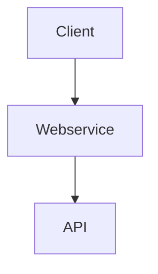

# Générateur de playlists


## Présentation application

**Le Générateur de playlist** est une application qui développe dans un premier temps un webservice et ensuite un client. 
L'application a pour objectif de permettre à l'utilisateur de générer une playliste aléatoire de musiques de ses artistes préférés. Pour ce faire, l'utilisateur a juste besoin de renseigner les noms de ses artistes préférés. Le webservice développé fournit l'information nécéssaire en se basant sur deux API: 

* AudioDB 
* LyricsOvh 

Le client (l'utilisateur, vous par exemple) donne un fichier json avec le nom de ses artistes préférés. Lorsque l'application est lancée, le webservice requète les API et renvoit la playlist demandée.




D'autres fonctionnalitées sont implémentées afin d'assurer le bon fonctionnement du webservice, ainsi qu'une meilleure expérience d'utilisaton pour préparer vos soirées karaoké entre amis :v:.


## Quick Start
Cette application a été developpée sous **Python3.8** et est accessible sur une version 3.9 de python. 
Pour lancer le code, vous allez suivre ces étapes simples:
### Cloner le repo
Première étape, cloner le repo via les commandes ci-dessous. Vous pouvez également simplement télécharger le projet.
```
git clone https://github.com/Rosette-dev/devoir_conception.git
```

Assurez vous que l'IDE que vous utilisez est bien configuré notamment au niveau du workspace et PYTHONPATH.
### Installer les modules
Ensuite, il est necessaire d'installer les libraries utiles (indispensable) au fonctionnement de l'app via la commande ci-dessous.
Pour installer les librairies utiles pour le webservice, il faut lancer le code suivant:
```
cd devoir_conception
cd Serveur
pip install -r requirements.txt
```
Pour installer celles utiles pour la partie Client, il faut lancer le code suivant:
```
cd ..
cd Client
pip install -r requirements.txt
```
### Configuration
Ensuite dernière étape avant de profiter pleinement de l'application, la configuration.
#### Variables d'environnement
Dans un fichier ```.env``` que vous placer dans le dossier **Client**, vous copier coller et remplissez les informations ci-dessous afin d'obtenir la playliste qui vous ravira. 
```
CLIENT_DATA= *****
TARGET_PORT=8000
URL_SERVICE= "http://127.0.0.1:8000"
```
**CLIENT_DATA** doit être un json qui permet d'avoir le nom des artistes. Par exemple:
```ruby
[
{
    "artiste": "daft punk",
    "note": 18
},
{
    "artiste":"gloria gaynor",
    "note": 10
}
]
```
## Utilisation de l'application
Une fois que vous avez correctement installé et configuré l'application, vous pouvez l'utiliser pour générer vos playlists.
Pour utiliser le webservice, il faut lancer le fichier ```main.py``` situé dans le fichier Serveur. Ensuite, dans un autre terminal, lancer un autre fichier ```main.py``` situé dans le dossier Client.

## Tests unitaires et Automatisation
 Nous avons testé la méthode **get_artiste()** qui permet de récupérer l'identifiant d'un artiste. Nous avons aussi testé le bon fonctionnement du Webservice.
 Pour lancer le test, il faut exécuter le bout de code suivant dans le terminal: 
``` 
cd Serveur
python -m unittest test.py
```
Un pipeline a été mis en place.Il s'exécute à chaque push et lance les tests unitaires présents dans le projet.

# Bonne utilisation !


